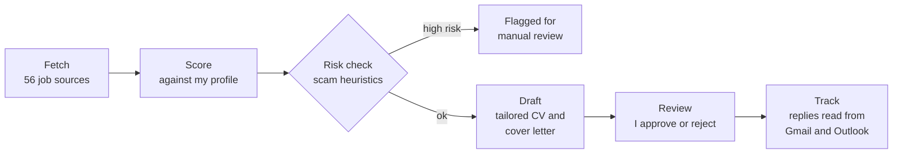
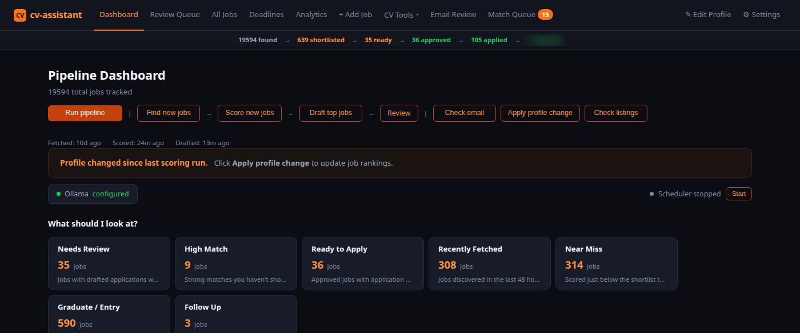
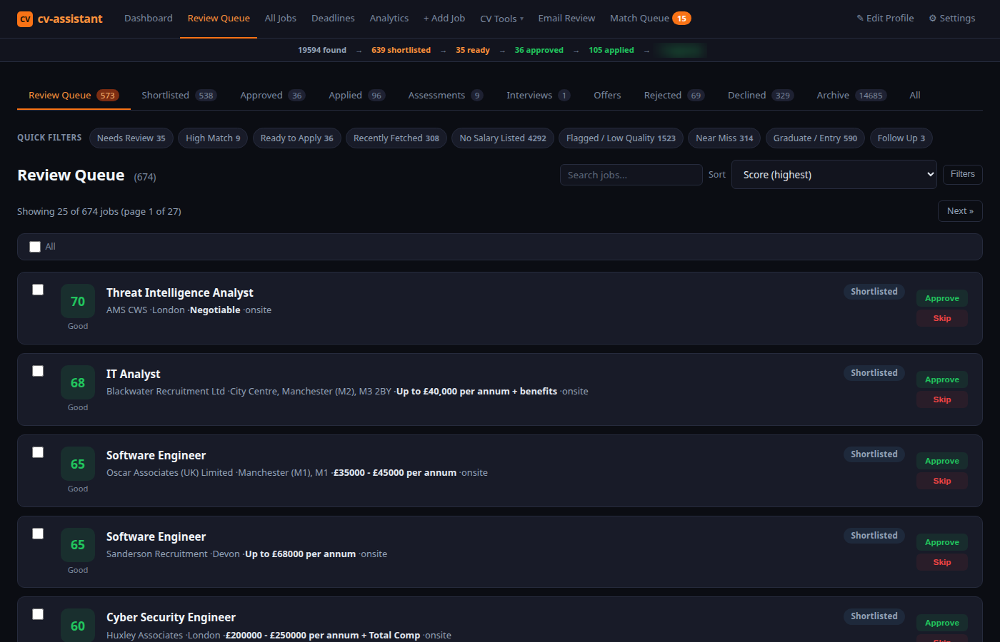
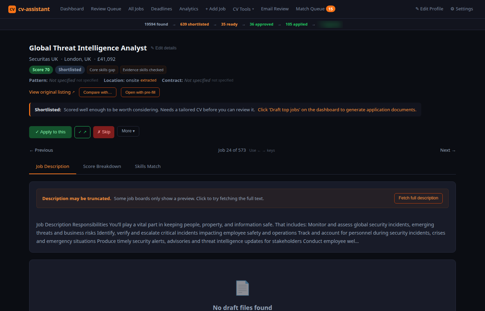
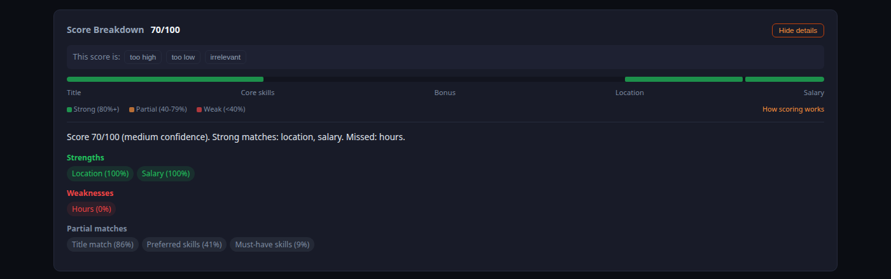
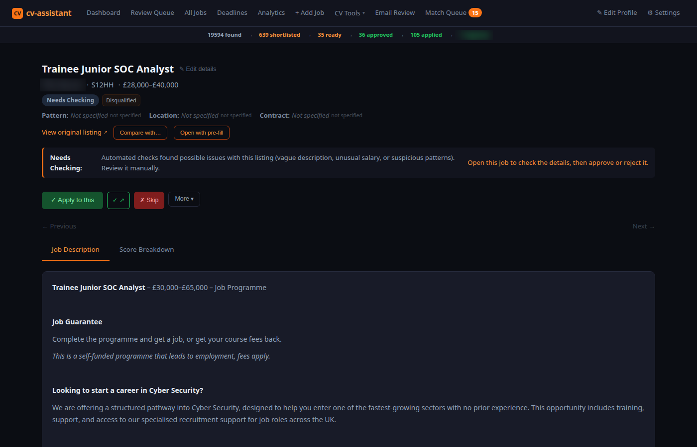
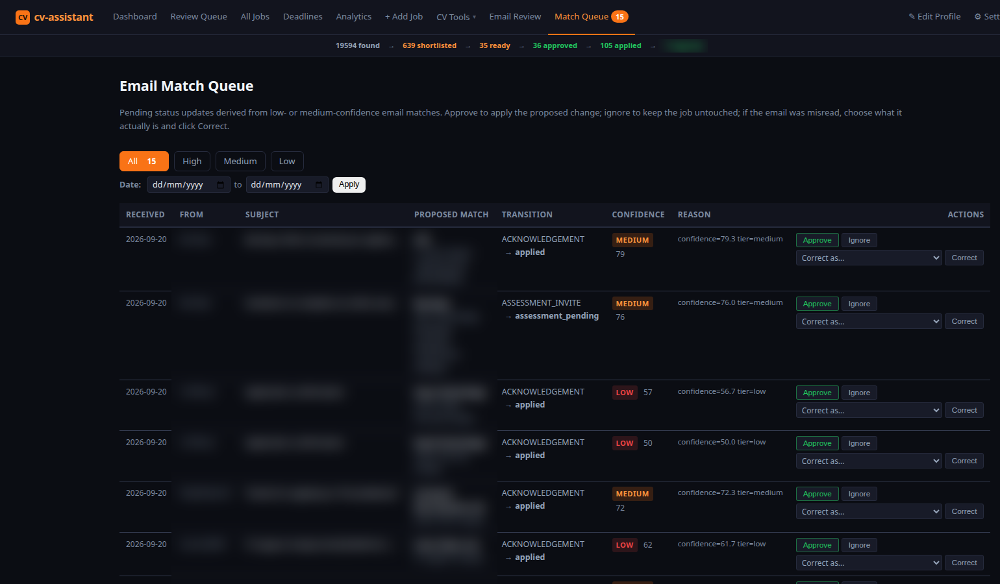
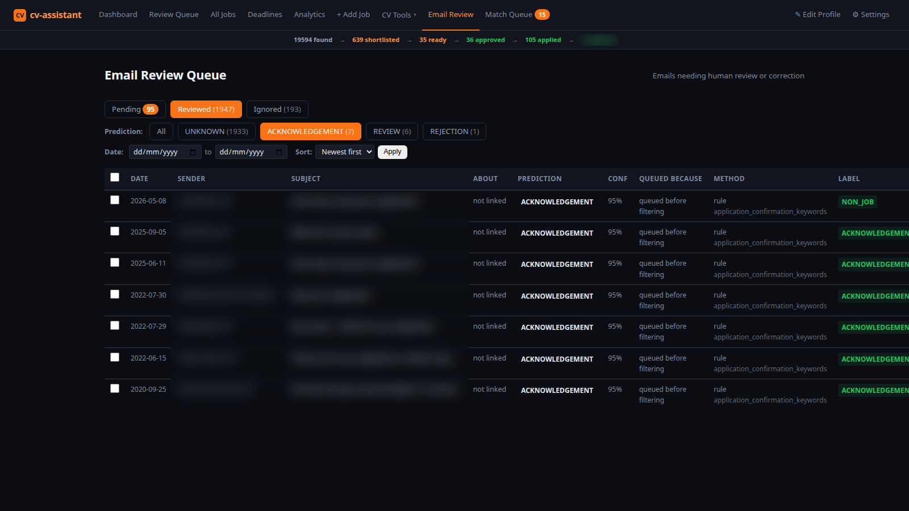

# cv-assistant

A job-search automation platform I designed and built, and use every day for my own job search.
It finds vacancies, scores them against my profile, screens out likely scams, drafts tailored
applications with an LLM, and tracks every application through to offer.

> **The source code is private**, because I may develop this into a commercial product. This
> repository is a showcase of what it does and how it's built. Technical interviewers can see the
> code on request: contact me through [LinkedIn](https://www.linkedin.com/in/thisisuly).

| | |
|---|---|
| **Language** | Python 3.12 / 3.13 |
| **Interfaces** | Command-line tool and a local Flask web dashboard |
| **Storage** | SQLite |
| **Size** | Around 110,000 lines of Python |
| **Tests** | Over 8,000 automated tests, plus Playwright browser tests |
| **Job sources** | 56, from national job boards to individual employers' careers sites |
| **Real use** | Over 19,000 listings processed in my own job search |
| **Started** | March 2026 |

---

## What it does

1. **Fetch.** Pulls listings from job-board APIs, the applicant tracking systems employers use
   (Greenhouse, Lever, SmartRecruiters and others), council and public-sector portals, and
   graduate boards. Every source is declared once in a single catalogue, and the setup wizard,
   health checks and documentation are all generated from it.
2. **Score.** Each job gets a score out of 100 from title match, skills overlap, location and
   salary, with bonuses and penalties on top. Every score comes with a breakdown explaining it,
   so I can see why a job ranked where it did.
3. **Risk check.** Offline heuristics look for the signs of a fake listing: payment requests,
   upfront training fees, vague descriptions, unrealistic pay and contact through messaging
   apps. High-risk jobs are held back before any application is drafted.
4. **Draft.** Generates a tailored CV and cover letter for the strongest matches. It works with
   Claude, OpenAI, Gemini or a local Ollama model, falling back from one to the next, and still
   produces a template draft if no AI is available.
5. **Review.** Nothing is sent without my approval. Drafts wait in a review queue.
6. **Track.** Reads employer replies from Gmail and Outlook, recognises rejections and interview
   invitations, and moves applications along. Once a job is marked as applied, no background
   process is allowed to move it backwards.

## Screenshots

These come from my own job search, taken on 30 September 2026. The only changes: the dashboard is
cropped above the list of employers I'm currently interviewing with, and one company name is
blurred (see the risk-check screenshot), along with the response count in the bar across the top
and the senders and subjects on the two email pages.

**Dashboard.** Nearly 19,600 jobs tracked, with the pipeline from found to applied across the top:

**Review queue.** Real listings ranked by how well they match my profile:

**A job**, with salary and location pulled out of the listing:

**Why it scored 70.** Every score explains itself. This one matched on location and salary but
only partly on skills, and the buttons let me mark a score as too high or too low:

**A listing held back for checking.** This "trainee SOC analyst" role is a self-funded training
course where fees apply, presented as a job. The risk analyser catches this pattern (upfront
fees behind a job title) before any time is spent applying. I've blurred the company's name,
because the point is the pattern and not the business:

**Match Queue.** Employer emails turned into proposed status changes. Each email is classified
(acknowledgement, assessment invite, rejection and so on), matched to the job it's about, and
given a confidence score. High-confidence updates apply themselves. Anything less waits here
for me to approve, ignore or correct, and corrections feed back into the classifier. Senders,
subjects and matched jobs are blurred:

**Email Review.** The audit trail behind the classifier: what each email was predicted to be,
how confident it was, which rule or model made the call, and the label I confirmed. Most of my
inbox is job-board notifications, which is why "unknown" dominates the counts. Senders and
subjects are blurred:

## Security

This tool handles my CV, my email inboxes and API keys, so I built it to the standard I'd expect
of production software.

**Checked on every push:**
- **CodeQL** static analysis.
- **Bandit** security linting, which must report zero medium or high findings.
- **pip-audit**, which checks dependencies against known vulnerabilities.
- **actionlint with shellcheck** on the CI workflows themselves.

**In the application:**
- **Web dashboard:** CSRF protection on every write, a Content Security Policy, clickjacking and
  MIME-sniffing headers, and a Host-header allowlist against DNS rebinding.
- **Path traversal:** every file path built from user input is resolved and checked to be inside
  its base directory before it's used.
- **Log injection:** scraped and user-supplied values are sanitised before they reach a log line.
- **Untrusted content:** job descriptions are sanitised before they're rendered, and uploaded
  Word documents are parsed with `defusedxml`.
- **Secrets:** keys are masked in the interface after saving, and error messages are cleaned
  before they're shown, so a stack trace can't leak a key.
- **Scam detection:** the risk analyser described above, which I tune by marking jobs as scam or
  safe.

## Testing

- **Over 8,000 pytest tests**, split into unit, integration and regression suites, run in random
  order on Python 3.12 and 3.13.
- **Playwright browser tests** for the dashboard, covering end-to-end flows, visual regression and
  accessibility.
- **Live checks** that go out to each job source and report which ones have stopped returning
  jobs, because a green test suite doesn't prove the tool is actually finding work.

One lesson from building this: tests can pass while the product is broken. At one point every
test was green and the tool was fetching zero jobs. Since then I prefer tests that cross real
boundaries, and I measure the product's actual output alongside the test results.

## Engineering decisions

- **Local-first.** Everything runs on my machine and the data never leaves it, apart from calls to
  whichever AI provider I choose, or none at all with a local model.
- **Human in the loop.** The tool drafts, and I decide. It never applies to a job on its own.
- **Cross-platform.** It runs on Linux, macOS and Windows. All OS-specific behaviour goes through
  one compatibility module, including scheduled runs through systemd, launchd or Task Scheduler.
- **Measured, not assumed.** Scoring changes are checked against real outcomes. For example, an
  embedding-based feature I expected to help made rankings worse, so I didn't ship it until a
  different design measurably improved them.

## Contact

[LinkedIn](https://www.linkedin.com/in/thisisuly) · [GitHub](https://github.com/thisisuly)

My other public work: [home-cyber-range](https://github.com/thisisuly/home-cyber-range) ·
[soc-log-tools](https://github.com/thisisuly/soc-log-tools) ·
[Honours-Project](https://github.com/thisisuly/Honours-Project)
